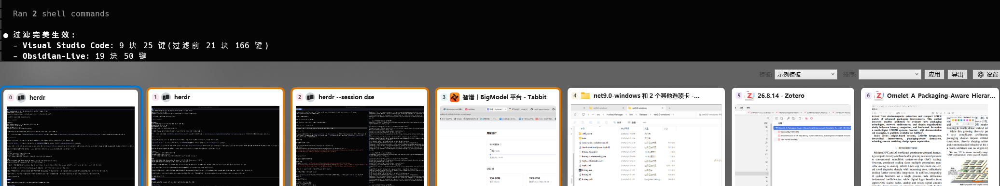

# alt-tab

Windows 桌面的 Alt+Tab 增强切换器：把"最近使用"变成**固定数字标签的槽位模型**，直达、固定、堆叠、模板，全都在一个轻量常驻小工具里。



C# / WPF / .NET 8 实现，安装包自包含 .NET 运行时，下载即装即用。

## 特性

- **槽位模型（固定=固定数字）**：pin 卡永久认领编号（3号永远是3号），未固定窗口按最近使用顺序流动补位；拖到固定卡旁边会"自然变成"空缺的编号
- **Alt+Tab 全屏切换面板**：实时窗口缩略图（DWM 合成，Mica 背景正确渲染）、当前窗口复制卡（左起第一张）、上一窗口卡（0 号恒存在）
- **快速直达 toggle**：`Alt+数字` 直达对应标签；目标已是前台时再按一次即**最小化**，再按恢复
- **同应用堆叠（级联子卡）**：同类窗口折成一张卡，从左往右叠半展示全部成员；`Alt+数字` 长按进入堆叠内部，数字键/方向键在成员间移动，拖出即剥离
- **成员固定**：堆叠内单个成员也可以固定位置，主标签与子标签联动
- **智能排序**：config.json 里写通用规则（按进程/路径/标题/组），未固定窗口按规则优先流动；固定卡永不被排序移动
- **模板**：把当前槽位布局一键导出为模板，之后一一对应套用（模板=整组固定）
- **双卡并存**：当前窗口 / 上一窗口本身是固定卡时，编号区真身保留、首部显示副本——固定卡"一直存在，除非解除固定"
- **托盘常驻**：左键设置、右键菜单，Explorer 重启自动重挂
- **轻量**：GC 堆软上限 128MB，空闲内存占用低

## 安装

从 [Releases](../../releases) 下载 `alt-tab-setup-*.exe`：

1. 双击安装（可自选路径，无需管理员）
2. 可选：创建桌面快捷方式 / 开机自动启动
3. 启动后常驻托盘，随时 `Alt+Tab` 唤出

卸载：Windows 设置 → 应用 → alt-tab。卸载保留你的 config.json（模板/排序配置）。

## 使用

默认热键（均可在 config.json 修改）：

| 按键 | 作用 |
|---|---|
| `Alt + Tab` | 唤出切换面板；按住 Alt 连按 Tab 循环，松开 Alt 确认跳转，`Esc` 取消 |
| `Alt + 1..9` | 一次直达对应编号的窗口（不弹面板）；目标已是前台时再按=最小化 |
| `Alt + 0` | 直达上一个使用的窗口 |
| `数字键`（面板内） | 跳到对应编号的卡；堆叠卡则进入其子页面 |
| 方向键 | 面板内网格移动；`Esc` 取消/返回 |

鼠标：点击卡片激活；📌 固定/解除固定；✕ 关闭窗口；拖拽排序（拖到固定卡左边会认领空缺编号）；拖一张卡到另一张上=堆叠集中，从堆叠拖出=剥离。

## 配置

- `config.json`（exe 同目录，便携）：热键、模板、智能排序规则。编辑后托盘/设置窗口重载
- `%APPDATA%\WindowSwitcherWpf\order.json`：固定（pins）持久化，含堆叠成员固定

## 构建

```bash
dotnet build -c Release src/WindowSwitcherWpf
# 产物: src/WindowSwitcherWpf/bin/Release/net8.0-windows/WindowSwitcherWpf.exe

# 自测（纯内存，不动真实配置）
src/WindowSwitcherWpf/bin/Release/net8.0-windows/WindowSwitcherWpf.exe --test-slots
src/WindowSwitcherWpf/bin/Release/net8.0-windows/WindowSwitcherWpf.exe --test-stack
src/WindowSwitcherWpf/bin/Release/net8.0-windows/WindowSwitcherWpf.exe --test-config

# 安装包（需要 Inno Setup 6：winget install JRSoftware.InnoSetup）
installer/build-installer.cmd
```

## 致谢

交互设计参考了 [sigoden/window-switcher](https://github.com/sigoden/window-switcher)（MIT）。本项目为**独立原创实现**（C#/WPF 从零重写），并非其 fork，未复制其源码；其 MIT 许可声明见 [REFERENCE_LICENSE](REFERENCE_LICENSE)。

## 许可证

[MIT](LICENSE) © 2026 1smil1
